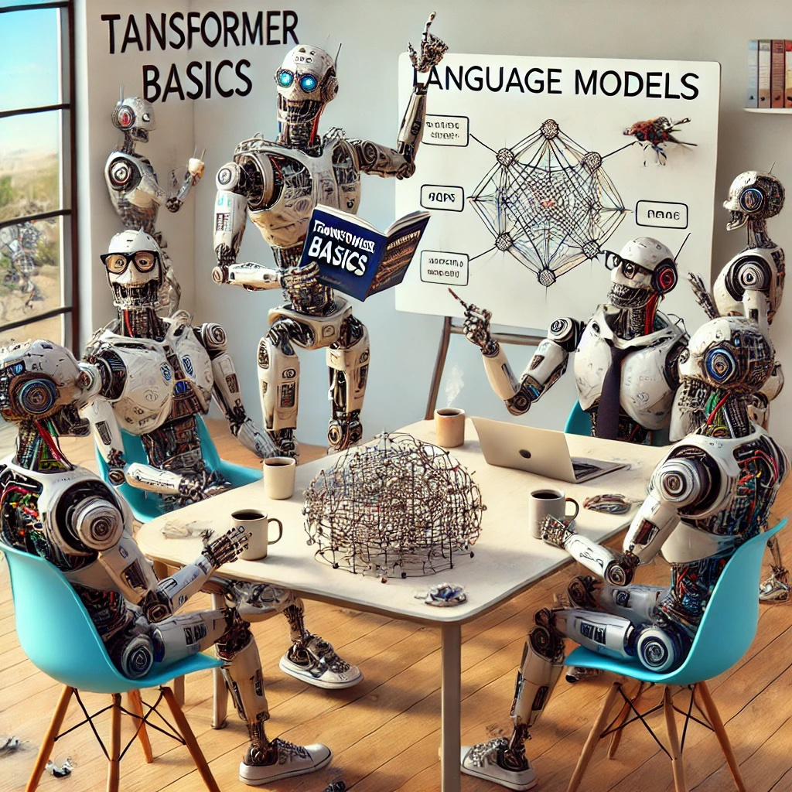

#  NLP Lectures - 2024



**Spoiler Alert: Useful only if you're crazy about implementing LLMs from scratch!**

This repo contains the codes for my presentation as guest speaker in the **CSI5137 graduate course** at the University of Ottawa. The codes are implementations of the language models with the following architectures.

1. **Frequency Counting (No-Context)**
2. **MLP (Bigram)**
3. **MLP (n-gram)**
4. **RNN**
5. **LSTM**
6. **Transformer**
7. **Micro-GPT**

The transformer part is implemented in 7 parts to show the effect of each part.

##  Getting Started...
Simply run the following command:
```
./docker.sh
```
You may need to change the gpu access according to your computer.

You can then run each of the architectures to train the language model and see the results via tensorboard.

For example, run the following:

```
python mh_attention_scratch_6.py
```